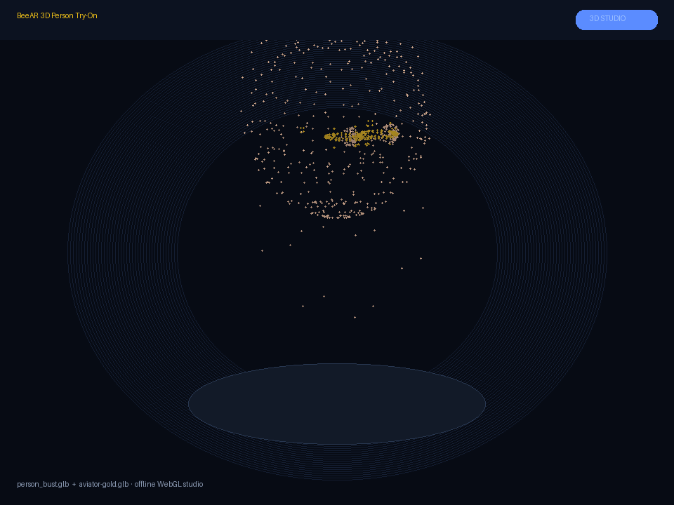
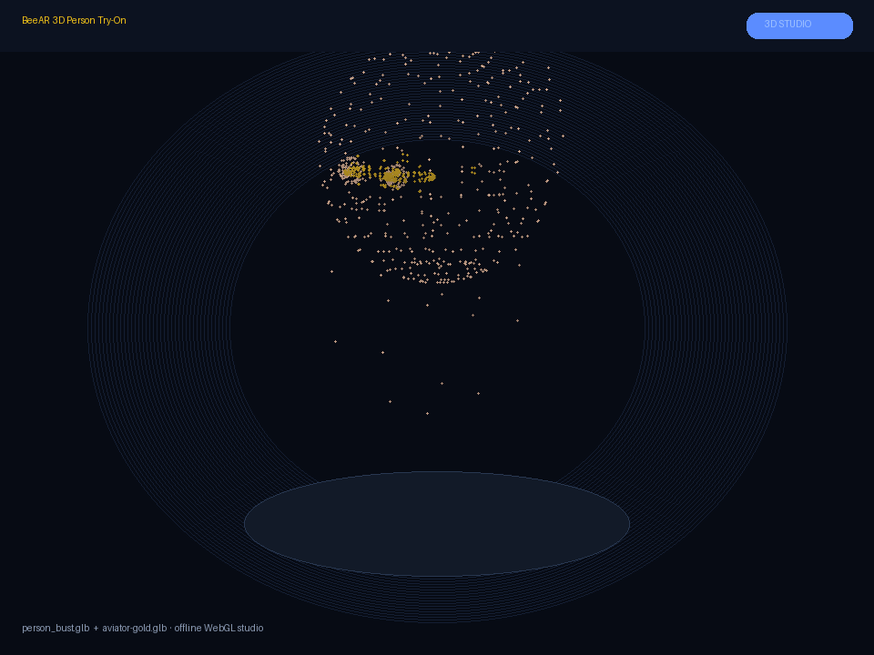

# BeeAR

[](https://www.python.org/downloads/)
[](packages/server/pyproject.toml)
[](packages/web/studio3d.html)
[](https://github.com/mergeos-bounties/BeeAR/releases/tag/libs-v0.3.0)
[](LICENSE)
[](https://github.com/mergeos-bounties)

**BeeAR** is a **virtual try-on** stack for **glasses and accessories** — frame catalog, **full 3D person + glasses GLB** studio, pupil-distance (PD) fit, multi-frame compare, plus web / desktop / Android clients on shared libraries.

**Product:** [mergeos-bounties/BeeAR](https://github.com/mergeos-bounties/BeeAR)

---

## Table of contents

- [3D person try-on (new)](#3d-person-try-on-new)
- [Demo video](#demo-video)
- [Monorepo packages](#monorepo-packages)
- [Libraries (web + Android)](#libraries-web--android)
- [Highlights](#highlights)
- [Screenshots](#screenshots)
- [Quick start (server)](#quick-start-server)
- [CLI reference](#cli-reference)
- [Catalog, fit & 3D assets](#catalog-fit--3d-assets)
- [Diagrams](#diagrams)
- [Repository layout](#repository-layout)
- [Privacy](#privacy)
- [Development](#development)
- [Android](#android)
- [MergeOS bounties](#mergeos-bounties)
- [License](#license)

---

## 3D person try-on (new)

BeeAR ships **full-body Meshy characters** (female + male) plus a low-poly bust, and **multiple glasses GLB meshes**. In the WebGL studio you can switch person, orbit, fit scale, auto-rotate, and snapshot. **v0.4.4** fixes 3D AR parenting (glasses stay locked on the face when the person reloads), face-anchor fit for Meshy bodies, and composites camera/demo GLB overlays onto the main canvas so snapshots match what you see.

| Asset | Path |
| --- | --- |
| **Female character** | `packages/catalog/glb/person_female.glb` (Meshy) |
| **Male character** | `packages/catalog/glb/person_male.glb` (Meshy) |
| **Studio bust (fallback)** | `packages/catalog/glb/person_bust.glb` |
| **Glasses GLBs** | **Meshy ellipse / square / studio** + aviator, wayfarer, round, cat-eye, sport, … |
| **Studio UI** | `packages/web/studio3d.html` → **`/studio3d.html`** (person dropdown + frames) |
| **2D + camera** | `/` (canvas try-on; GLB overlay when WebGL available) |

```powershell
cd packages\server
pip install -e ".[dev]"
beear serve --port 8860
# open:
#   http://127.0.0.1:8860/studio3d.html   ← 3D person + glasses
#   http://127.0.0.1:8860/                 ← camera / demo photo
```

Regenerate meshes (offline, no network):

```powershell
python packages\catalog\scripts\generate_3d_assets.py
```

<p align="center">
  
</p>
<p align="center"><em>3D person bust + Aviator Gold GLB (offline mesh render used for docs)</em></p>

---

## Demo video

Full rotation of the **3D person** with **glasses GLB** try-on:

https://github.com/mergeos-bounties/BeeAR/raw/master/docs/videos/beear-3d-tryon.mp4

<p align="center">
  <a href="docs/videos/beear-3d-tryon.mp4">
    
  </a>
</p>
<p align="center"><em>Click the poster or open <a href="docs/videos/beear-3d-tryon.mp4"><code>docs/videos/beear-3d-tryon.mp4</code></a></em></p>

Rebuild the video after asset changes:

```powershell
python scripts\render_3d_demo_video.py
```

---

## Monorepo packages

| Package | Path | Role |
| --- | --- | --- |
| **@beear/tryon** | `packages/tryon-js` | Shared JS try-on lib (fit, overlay) for web + Android WebView |
| **BeeAR Server** | `packages/server` | Catalog API, try-on helpers, FastAPI, CLI (`beear`) |
| **BeeAR Web** | `packages/web` | Browser host + **3D Studio** |
| **BeeAR Desktop** | `packages/desktop` | Electron shell wrapping the web app |
| **beear-webview** | `packages/android/beear-webview` | **Android library (AAR)** — reusable WebView try-on |
| **BeeAR Android app** | `packages/android/app` | Demo host embedding the AAR |
| **Catalog** | `packages/catalog` | SVG + **GLB** frames + person models |

Primary offline path: **server** (`beear demo` · `beear serve`).

---

## Libraries (web + Android)

BeeAR try-on ships as **reusable libraries** — download prebuilt artifacts from GitHub Releases:

**[libs-v0.3.0](https://github.com/mergeos-bounties/BeeAR/releases/tag/libs-v0.3.0)**

| Lib | Artifact | Consumers |
| --- | --- | --- |
| **`@beear/tryon`** | [`beear-tryon-0.3.0.js`](https://github.com/mergeos-bounties/BeeAR/releases/download/libs-v0.3.0/beear-tryon-0.3.0.js) · [npm tgz](https://github.com/mergeos-bounties/BeeAR/releases/download/libs-v0.3.0/beear-tryon-0.3.0.tgz) | Web host, Android WebView, desktop |
| **`com.beear:beear-webview`** | [`beear-webview-0.3.0.aar`](https://github.com/mergeos-bounties/BeeAR/releases/download/libs-v0.3.0/beear-webview-0.3.0.aar) | Any Android app embedding try-on |

### Web install

```html
<script src="https://github.com/mergeos-bounties/BeeAR/releases/download/libs-v0.3.0/beear-tryon-0.3.0.js"></script>
<script>
  console.log(BeeARTryOn.VERSION); // 0.3.0
</script>
```

```bash
npm install https://github.com/mergeos-bounties/BeeAR/releases/download/libs-v0.3.0/beear-tryon-0.3.0.tgz
```

### Android install

```kotlin
// app/libs/beear-webview-0.3.0.aar
implementation(files("libs/beear-webview-0.3.0.aar"))

val view = BeeARWebView(this)
view.attach(this, BeeARConfig.loopback()) // or BeeARConfig.offlineAssets()
view.loadTryOn()
```

### Build from source

```bash
cd packages/tryon-js && npm test && npm run build

node packages/android/scripts/sync-web-assets.mjs
cd packages/android && ./gradlew :beear-webview:assembleRelease

node scripts/release-libs.mjs
node scripts/release-libs.mjs --publish
```

Docs: [packages/tryon-js/README.md](packages/tryon-js/README.md) · [packages/android/README.md](packages/android/README.md)

---

## Highlights

| Capability | Description |
| --- | --- |
| **3D person** | Low-poly `person_bust.glb` with face anchor for glasses |
| **GLB glasses** | Multiple styles (aviator, wayfarer, round, cat-eye, sport, …) |
| **3D Studio** | Orbit / zoom / auto-rotate try-on at `/studio3d.html` |
| **Frame catalog** | Glasses + accessories with SVG + GLB |
| **PD fit** | Pupil distance (mm) + landmark box |
| **Compare** | Side-by-side frame metrics |
| **Offline demo** | Catalog + fit + compare without a camera |
| **Clients** | Web, desktop, Android over shared libs |

---

## Screenshots

### 3D studio

| | |
| :---: | :---: |
|  |  |
| *Person + aviator GLB* | *Alternate orbit* |

### 2D / camera try-on

| | |
| :---: | :---: |
|  |  |
| *Aviator on demo face* | *Wayfarer Black* |
|  |  |
| *Cat-eye Rose* | *Sport · PD 70* |
|  |  |
| *Compare frames* | *VI UI* |

---

## Quick start (server)

```powershell
cd packages\server
python -m venv .venv
.\.venv\Scripts\activate
pip install -e ".[dev]"

beear version
beear demo
beear catalog list
beear tryon fit aviator_gold --pd 64
beear serve --port 8860
```

Then open:

- **3D person try-on:** http://127.0.0.1:8860/studio3d.html  
- **Camera / demo photo:** http://127.0.0.1:8860/  

---

## CLI reference

| Command | Purpose |
| --- | --- |
| `beear version` | Package version (**0.4.0**) |
| `beear demo` | Catalog + PD fit + compare + **3D person/GLB** smoke |
| `beear catalog list [-c category]` | List frames |
| `beear catalog show <id>` | Frame detail |
| `beear catalog search <q>` | Search frames |
| `beear tryon fit <id> --pd 64` | Fit estimate |
| `beear tryon compare <a> <b>` | Compare two frames |
| `beear serve` | FastAPI + web + **studio3d** |

---

## Catalog, fit & 3D assets

- Frames: id, name, category, style, price, SVG, optional **GLB**.  
- Person models: listed under `person_models` in `packages/catalog/frames.json`.  
- Fit uses PD (mm) and landmark box (synthetic when offline).  
- API: `GET /api/catalog`, `GET /api/catalog/meta`, `GET /catalog/glb/{file}`.

```powershell
beear catalog list -c glasses
beear tryon compare aviator_gold wayfarer_black --pd 64
python packages\catalog\scripts\generate_3d_assets.py
```

---

## Diagrams

System architecture and workflow — full width. Open the HTML files for **dark/light theme** and export (PNG/SVG).

### Architecture

[Open interactive diagram](docs/diagrams/architecture.html)

<p align="center">
  
</p>

### Workflow

[Open interactive diagram](docs/diagrams/workflow.html)

<p align="center">
  
</p>

*Generated with [archify](https://github.com/tt-a1i).*

---

## Repository layout

```text
packages/
  catalog/
    glb/              # person_bust + glasses meshes
    svg/              # 2D frame icons
    frames.json       # catalog + person_models
    scripts/generate_3d_assets.py
  server/src/beear/   # CLI, API, catalog, tryon
  web/
    index.html        # camera / demo face try-on
    studio3d.html     # 3D person + GLB studio
    assets/
  tryon-js/ desktop/ android/
docs/
  videos/beear-3d-tryon.mp4
  screenshots/
  diagrams/
scripts/render_3d_demo_video.py
```

---

## Privacy

- Prefer synthetic / consented demo faces in docs and CI.
- Do not commit real user camera captures without consent.
- Camera video stays in the browser; it is not uploaded by the default server.
- See [docs/PRIVACY.md](docs/PRIVACY.md).

---

## Development

```powershell
cd packages\server
pytest -q
ruff check src tests
beear demo

# assets + docs media
python ..\..\packages\catalog\scripts\generate_3d_assets.py
python ..\..\scripts\render_3d_demo_video.py
```

---

## Android

Demo app and **AAR library** live under `packages/android/`.  
See [packages/android/README.md](packages/android/README.md) for Gradle sync, camera consent, and WebView loopback.

---

## MergeOS bounties

Star → claim a bounty issue → PR to **master** → MRG **25–200**.  
See [mergeos](https://github.com/mergeos-bounties/mergeos) and [docs/BOUNTY.md](docs/BOUNTY.md).

---

## License

[MIT](LICENSE)
