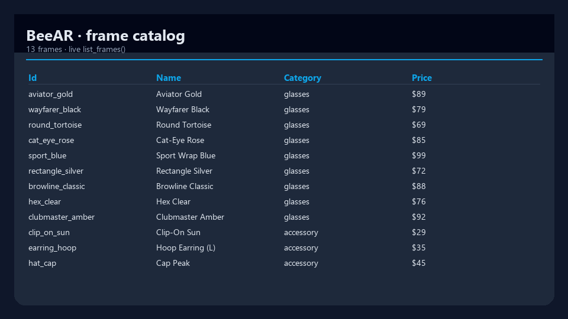
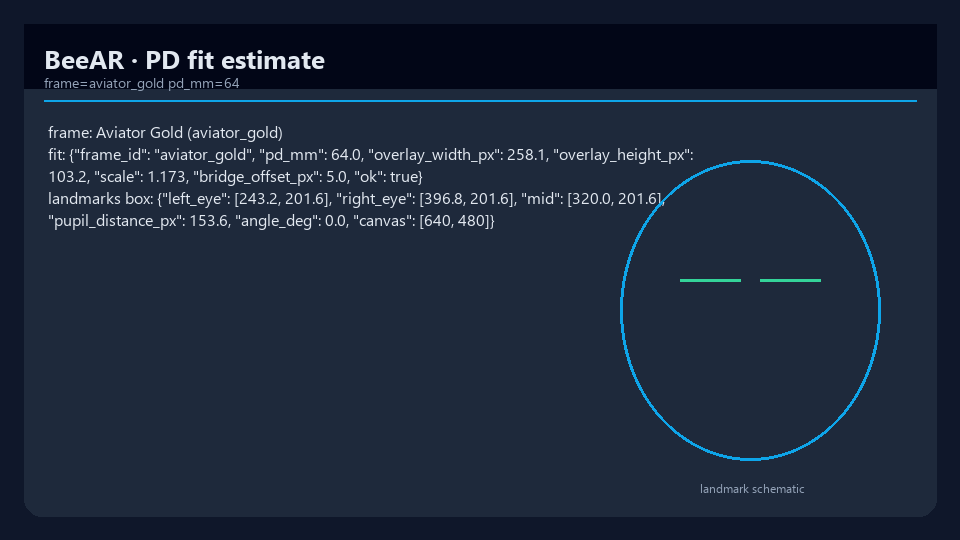
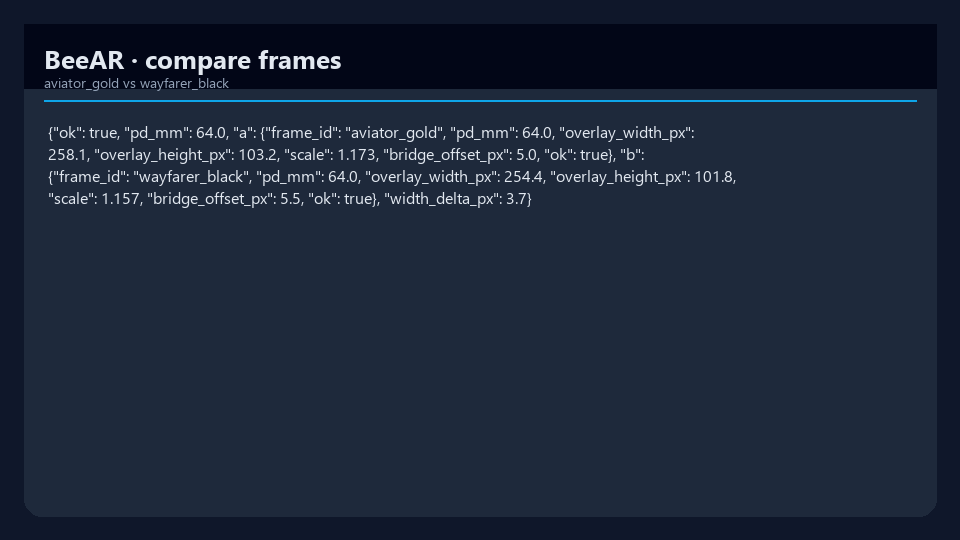

# BeeAR

[](https://www.python.org/downloads/)
[](packages/server/pyproject.toml)
[](LICENSE)
[](https://github.com/mergeos-bounties)

**BeeAR** is a **virtual try-on** stack for **glasses and accessories** — frame catalog, pupil-distance (PD) fit estimates, multi-frame compare, plus web / desktop / Android clients.

Product: [mergeos-bounties/BeeAR](https://github.com/mergeos-bounties/BeeAR)

---

## Table of contents

- [Monorepo packages](#monorepo-packages)
- [Libraries (web + Android)](#libraries-web--android)
- [Highlights](#highlights)
- [Screenshots](#screenshots)
- [Quick start (server)](#quick-start-server)
- [CLI reference](#cli-reference)
- [Catalog & fit](#catalog--fit)
- [Diagrams](#diagrams)
- [Architecture](#architecture)
- [Privacy](#privacy)
- [Development](#development)
- [Android](#android)
- [MergeOS bounties](#mergeos-bounties)
- [License](#license)

---

## Monorepo packages

| Package | Path | Role |
| --- | --- | --- |
| **@beear/tryon** | `packages/tryon-js` | **Shared JS try-on lib** (fit, overlay) for web + Android WebView |
| **BeeAR Server** | `packages/server` | Catalog API, try-on helpers, FastAPI, CLI (`beear`) |
| **BeeAR Web** | `packages/web` | Thin browser host over `@beear/tryon` |
| **BeeAR Desktop** | `packages/desktop` | Electron shell wrapping the web app |
| **beear-webview** | `packages/android/beear-webview` | **Android library (AAR)** — reusable WebView try-on |
| **BeeAR Android app** | `packages/android/app` | Demo host embedding the AAR |

Primary offline path: **server** (`beear demo`).

---

## Highlights

| Capability | Description |
| --- | --- |
| **Frame catalog** | Aviator, wayfarer, cat-eye, sport, accessories… |
| **PD fit** | Estimate fit from pupil distance (mm) + landmarks box |
| **Compare** | Side-by-side frame metrics |
| **Offline demo** | Catalog + fit + compare without a camera |
| **Clients** | Web host, desktop, Android app over shared libs |
| **JS lib** | `@beear/tryon` for canvas fit/overlay |
| **Android lib** | `:beear-webview` AAR for any host app |

---

## Screenshots

| Try-on demos | |
| :---: | :---: |
|  |  |
| *Aviator Gold* | *Wayfarer Black* |
|  |  |
| *Cat-eye Rose* | *Sport · PD 70* |
|  |  |
| *Compare frames* | *Accessory* |

| Server / metrics | |
| :---: | :---: |
|  |  |
| *Live catalog list* | *PD fit + landmarks schematic* |
|  |  |
| *Compare metrics* | *VI UI sample* |

---

## Quick start (server)

```powershell
cd packages\server
python -m venv .venv
.\.venv\Scripts\activate
pip install -e ".[dev]"

beear version
beear demo
beear catalog list
beear tryon fit <frame_id> --pd 64
beear serve --port 8860
```

---

## CLI reference

| Command | Purpose |
| --- | --- |
| `beear version` | Package version |
| `beear demo` | Catalog + PD fit + compare smoke |
| `beear catalog list [-c category]` | List frames |
| `beear catalog show <id>` | Frame detail |
| `beear tryon fit <id> --pd 64` | Fit estimate |
| `beear tryon compare <a> <b>` | Compare two frames |
| `beear serve` | FastAPI server |

---

## Catalog & fit

Frames include id, name, category, style, price, geometry hints.
Fit uses pupil distance in mm and a landmark bounding box (demo uses synthetic landmarks when no camera).

```powershell
beear catalog list -c glasses
beear tryon compare aviator_gold wayfarer_black --pd 64
```

---


## Diagrams

System architecture and workflow — shown full-width below.
Open the HTML files for **dark/light theme toggle** and export (PNG/SVG).

### Architecture

[Open interactive diagram](docs/diagrams/architecture.html)

<p align="center">
  
</p>

### Workflow

[Open interactive diagram](docs/diagrams/workflow.html)

<p align="center">
  
</p>

*Generated with [archify](https://github.com/tt-a1i).*


## Libraries (web + Android)

BeeAR try-on is designed as **reusable libraries**:

| Lib | Consumers |
| --- | --- |
| **`@beear/tryon`** (`packages/tryon-js`) | Web host, Android WebView, desktop |
| **`com.beear.webview`** (`:beear-webview` AAR) | Any Android app embedding try-on |

```bash
# JS lib
cd packages/tryon-js && npm test && npm run build

# Android AAR
cd packages/android && ./gradlew :beear-webview:assembleRelease
# optional offline assets into the AAR:
node packages/android/scripts/sync-web-assets.mjs
```

Host apps depend on `:beear-webview` and call `BeeARWebView.attach(activity, BeeARConfig.loopback())`.
See [packages/android/README.md](packages/android/README.md) and [packages/tryon-js/README.md](packages/tryon-js/README.md).

## Architecture

```text
  Web / Desktop / Android
            │
            â–¼
     BeeAR Server (FastAPI)
       catalog · sessions · tryon
            │
     landmark / PD fit engine
```

```text
packages/server/src/beear/
  cli.py
  catalog.py
  tryon.py
  api.py
docs/screenshots/
```

---

## Privacy

- Prefer synthetic / consented demo faces in docs and CI.
- Do not commit real user camera captures without consent.
- Redact PII in issue evidence.

---

## Development

```powershell
cd packages\server
pytest -q
ruff check src tests
beear demo
```

---

## Android

See [packages/android/README.md](packages/android/README.md) for the Kotlin WebView client. It loads `http://localhost:8860/` through `adb reverse` for emulator or USB-device testing, keeping camera capture available on a loopback origin.

```bash
cd packages/android
./gradlew :app:testDebugUnitTest
./gradlew :app:assembleDebug
```

---

## MergeOS bounties

Frames, MediaPipe landmarks, PD calibration, Android UX.
Star → claim → PR **master** → MRG **25–200**. Evidence: web/desktop screenshots or emulator shots.

---

## Tiếng Việt

**BeeAR** thử kính/phụ kiện ảo (catalog + fit PD). Offline: `cd packages/server && beear demo`.

---

## License

MIT · MergeOS / ThanhTrucSolutions
